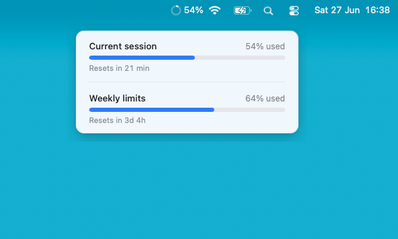

# Claude Usage Monitor

A tiny macOS **menu-bar app** that shows your Claude usage at a glance — your
**Current session** (5-hour window) and **Weekly limits** — mirroring what Claude
Code's `/usage` screen displays.

<p align="center">
  
</p>

Built with [Tauri 2](https://tauri.app) (Rust backend + vanilla TS frontend).

## What it does

- **In the menu bar:** a gauge icon + your current-session **%**. The gauge depletes
  as the session nears its reset (time remaining), and its **color reflects pace**,
  not raw usage — green when on track, yellow/red when you're burning fast enough to
  hit the limit *before* the reset.
- **Hover the icon:** a popover with two progress bars (**Current session** /
  **Weekly limits**) and a "Resets in …" countdown.
- No Dock icon. Right-click the menu-bar icon for **Launch at login** / **Quit**.

## How it works

1. **Token — macOS Keychain.** Reads the live OAuth access token from the Keychain
   entry `Claude Code-credentials` (the one Claude Code keeps fresh) — piggybacking
   on Claude Code's own refresh, so there's no separate login.
   > `~/.claude/.credentials.json` exists, but its token is often stale on macOS;
   > the live one lives in the Keychain.
2. **Usage — undocumented OAuth endpoint.** A background Rust thread calls
   `GET https://api.anthropic.com/api/oauth/usage` and parses `five_hour` /
   `seven_day` (utilization 0–100 + `resets_at`).
   - It **must** send `User-Agent: claude-code/<version>` or it lands in a harshly
     throttled `429` bucket. It polls slowly (60s) and backs off on `429`.
3. **No `reqwest`** — uses the system `security` (Keychain) and `curl` via
   `std::process::Command`, keeping the binary small.

> **Unofficial / against ToS.** The endpoint is undocumented and using the Claude
> Code OAuth token from a third-party tool is against Anthropic's ToS. This is for
> personal, local, read-only monitoring with your own account.

## Download

Prebuilt installers are available on the GitHub Releases page.

- **[Apple Silicon (M1/M2/M3/M4) - Download DMG](https://github.com/jeilsonaraujo/claude_status/releases/download/0.1.0/Claude-Usage-Monitor-0.1.0-arm64.dmg)**

> The link above always points to the latest release.

## Develop

```bash
bun install
bun run tauri dev
```

On first launch macOS prompts for Keychain access — click **Always Allow**.

## Build & package

```bash
brew install create-dmg     # once
./scripts/make-dmg.sh       # builds the .app + the styled installer .dmg
```

Output: `src-tauri/target/release/bundle/dmg/`. The app is ad-hoc signed (not
notarized) — on first open, right-click the app → **Open**.

## Layout

- `src/` — frontend: the popover (two bars), polling/render, fade + bar animation.
- `src-tauri/src/lib.rs` — Keychain read, usage fetch, and the tray (gauge icon,
  `%` title, pace color, hover popover).
- `scripts/` — `gen_tray_frames.py` (tray gauge frames) and `make-dmg.sh`.
